<p align="center"></p>

<h3 align="center">이 장소, 내 반려견이 들어갈 수 있을까요? 공공데이터 원문을 근거로 답합니다.</h3>

<p align="center"><a href="https://paw-trail.click"><b>서비스 바로 가기</b></a> · <a href="https://paw-trail.click/privacy">개인정보처리방침</a> · <a href="#7-레포-안내">레포 안내</a></p>

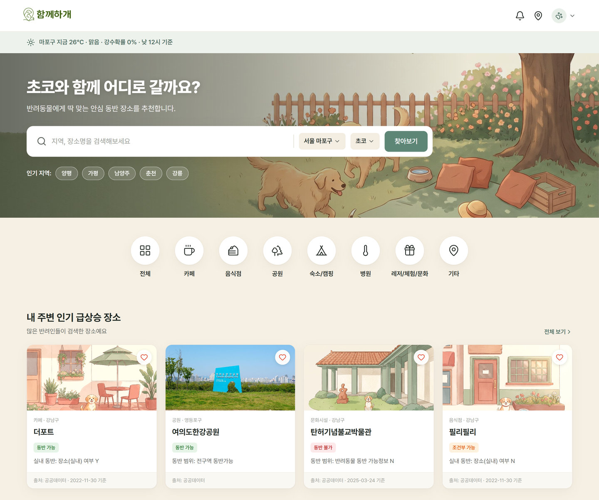

*메인 — 인기 급상승 장소 카드마다 반려견 기준 판정이 붙습니다*

**함께하개**는 반려견과 함께 갈 곳의 동반 조건을 공공데이터 원문에서 읽어, *내 반려견 기준*으로 가능 · 조건부 · 불가 · 확인 필요 4단계로 판정하는 웹 서비스입니다.
판정마다 어느 기관의 어떤 자료에 무엇이라고 적혀 있었는지를 원문 그대로 붙이고, 자료끼리 조건이 다르면 한쪽을 고르지 않고 나란히 보여 줍니다.

| 공공데이터 원문 | 합친 장소 | 동반 조건이 있는 장소 | 근거 문장 | 서비스 |
|---|---|---|---|---|
| 17,471건 | 19,501곳 | 12,848곳 | 53,637줄 | 16개 (MSA) |

<sub>숫자는 2026년 9월 19일 전체 추출 기준입니다.</sub>

2026 관광데이터 활용 공모전 웹 · 앱 구현 부문(지정과제 6번 — 반려동물 출입 조건 인지 오류로 인한 헛걸음) 출품작이며, [paw-trail.click](https://paw-trail.click) 에서 운영하고 있습니다.

<br><br>

---

## 1. 왜 만들었나

반려견과 함께 나섰다가 입구에서 돌아서는 일, 이 서비스는 그 *헛걸음*을 줄이려고 만들었습니다.
동반 조건은 이미 공공데이터로 공개되어 있지만, 그대로는 「내 반려견이 들어갈 수 있는가」 에 답하기 어렵습니다.

| 어려움 | 실제 모습 |
|---|---|
| 조건이 여러 자료에 흩어져 있습니다 | 한 장소를 한국관광공사 반려동물 동반여행 API · 고캠핑 API · 한국문화정보원 반려동물 동반 가능 문화시설 CSV 가 따로 다룹니다 |
| 조건이 칸이 아니라 문장입니다 | 「7kg 이하 최대 3마리」 · 「금, 토, 국가공휴일엔 동반 불가」 · 「이동장(켄넬)사용」 처럼 글로 적혀 있습니다 |
| 낱말만 보면 거꾸로 읽힙니다 | 어느 숙소의 「동반 가능 반려동물」 칸에는 「안내견」 한 단어만 적혀 있습니다. 일반 반려견은 안 된다는 뜻인데 「불가」 라는 글자가 없어, 낱말로 찾으면 가능으로 읽힙니다 |
| 자료끼리 말이 다릅니다 | 합친 장소 가운데 114곳은 자료끼리, 또는 한 자료 안에서 조건이 서로 다르게 적혀 있습니다 (자료 사이 33곳 · 자료 안 81곳) |

그래서 함께하개는 원문을 모아 조건을 정해진 칸으로 읽고, 반려견 정보와 맞대어 판정하되, 근거와 엇갈림을 숨기지 않기로 했습니다.

<br><br>

---

## 2. 네 가지 약속

약속마다 대표 화면 한 장을 보이고, 나머지 화면은 「화면 더 보기」 에 접어 두었습니다.

<br><br>

---

### #헛걸음방지 — 가기 전에 판정을 먼저 봅니다

검색 결과는 장소마다 반려견 기준 판정 뱃지를 달고, 맨 위에서 판정별 건수를 셉니다.
판정에 필요한 조건이 하나라도 비어 있으면 「가능」 이라고 하지 않고 「확인 필요」 로 둡니다. 모르는 것을 가능으로 올리면, 헛걸음을 막으려는 서비스가 오히려 헛걸음을 만들기 때문입니다.

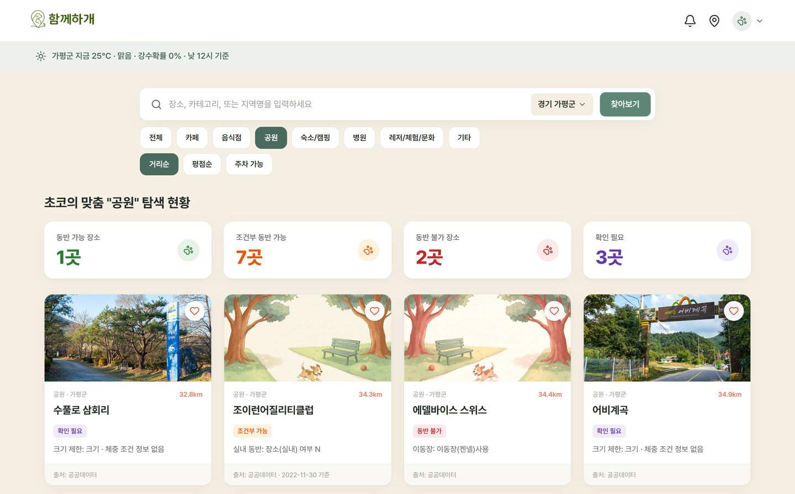

*공원 검색 결과 — 맨 위에 판정별 건수, 카드마다 판정 뱃지와 한 줄 근거*

**맡은 곳** — [`search-service`](https://github.com/paw-trail/search-service) 가 장소를 찾고, [`verdict-service`](https://github.com/paw-trail/verdict-service#2-3-모르는-것을-가능으로-올리지-않습니다) 가 판정합니다.

<details>
<summary>화면 더 보기 — 메인 전체 · 검색 결과 전체 · 정보가 없어 「확인 필요」 인 장소</summary>

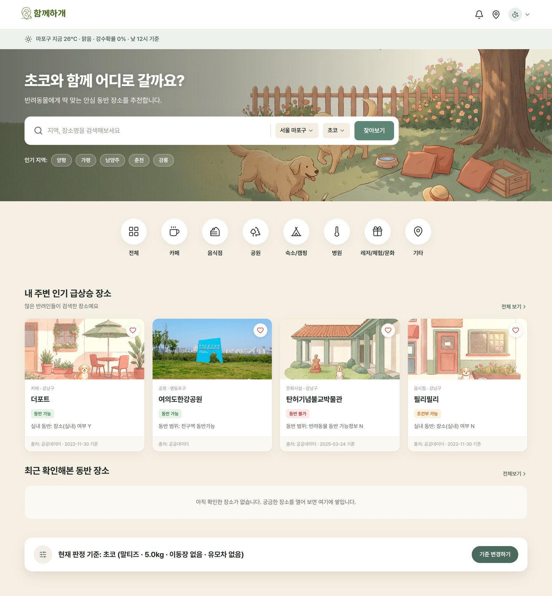

*메인 — 지역 날씨 · 검색 · 종류 · 인기 급상승 · 지금 판정 기준*

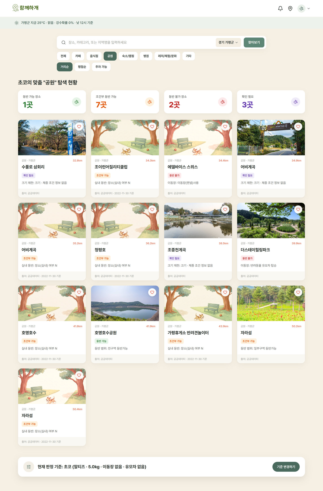

*검색 결과 전체 — 카드마다 거리 · 판정 뱃지 · 한 줄 근거*

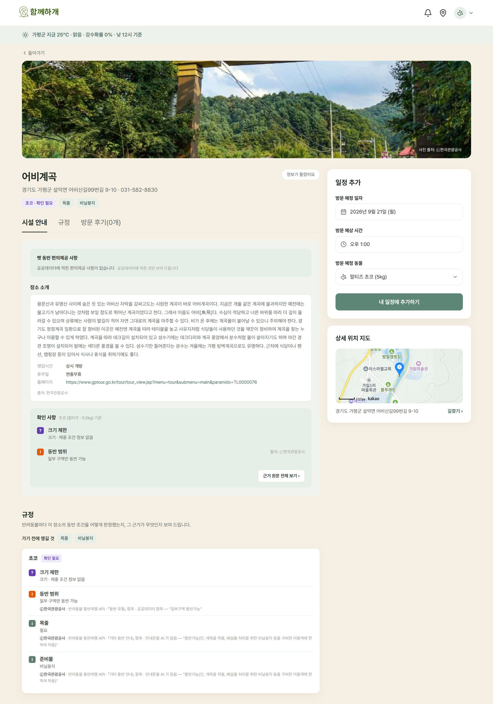

*어비계곡 — 크기 조건이 적혀 있지 않아 「확인 필요」, 규정 줄마다 출처*

</details>

<br><br>

---

### #내아이기준판정 — 같은 장소도 반려견마다 답이 다릅니다

반려견의 체중 · 크기 · 맹견 여부 · 이동장과 유모차 · 접종 증명서를 장소의 조건과 하나씩 맞대어, 마리마다 따로 판정합니다.
여러 마리를 데려갈 때는 「모두 함께」 로 가장 엄격한 판정을 봅니다. 크기는 몸무게로 정해지므로, 믹스견 보호자도 크기를 몰라 막히지 않습니다.

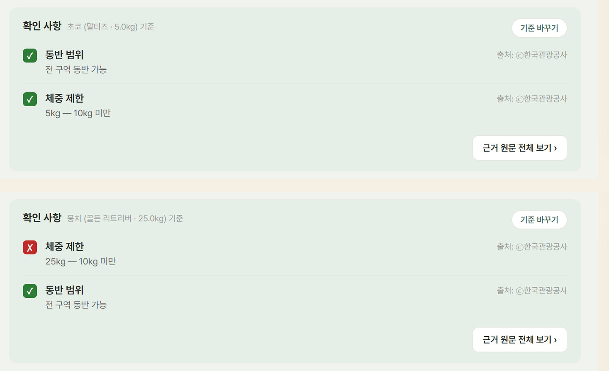

*같은 장소의 확인 사항 — 위는 말티즈 5kg 기준으로 모두 통과, 아래는 골든 리트리버 25kg 기준으로 체중 제한에 걸립니다*

**맡은 곳** — [`pet-service`](https://github.com/paw-trail/pet-service#2-크기를-어떻게-정하는가) 가 반려견 정보를 맡고, [`verdict-service`](https://github.com/paw-trail/verdict-service#2-5-반려동물마다-따로-판정합니다) 가 마리마다 판정합니다.

<details>
<summary>화면 더 보기 — 반려동물 정보 · 판정 기준 바꾸기 · 두 반려견의 장소 상세</summary>

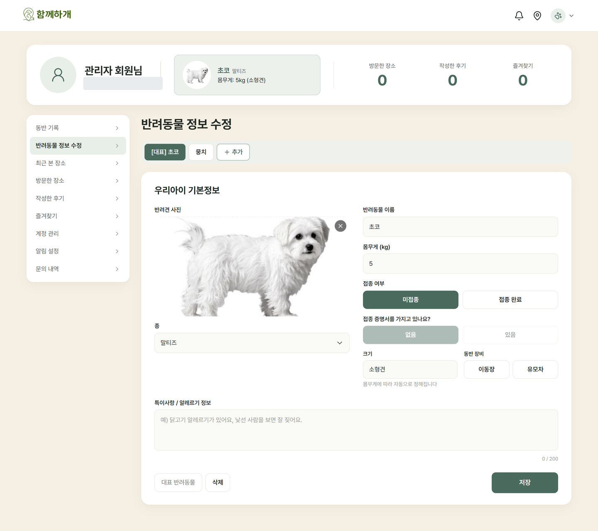

*반려동물 정보 — 몸무게 · 접종 · 증명서 · 이동장과 유모차, 크기는 몸무게로 자동*

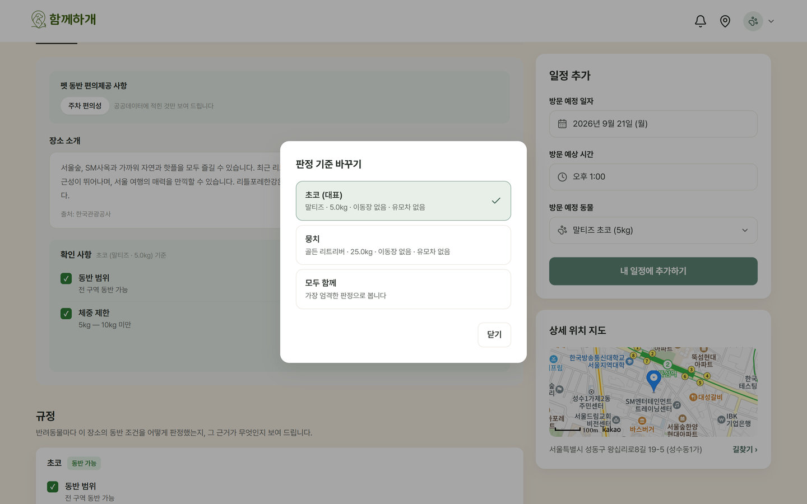

*판정 기준 바꾸기 — 한 마리씩, 또는 모두 함께*

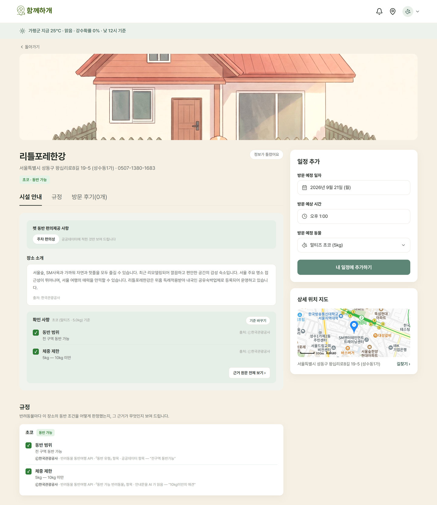

*말티즈 5kg 기준 — 「동반 가능」*

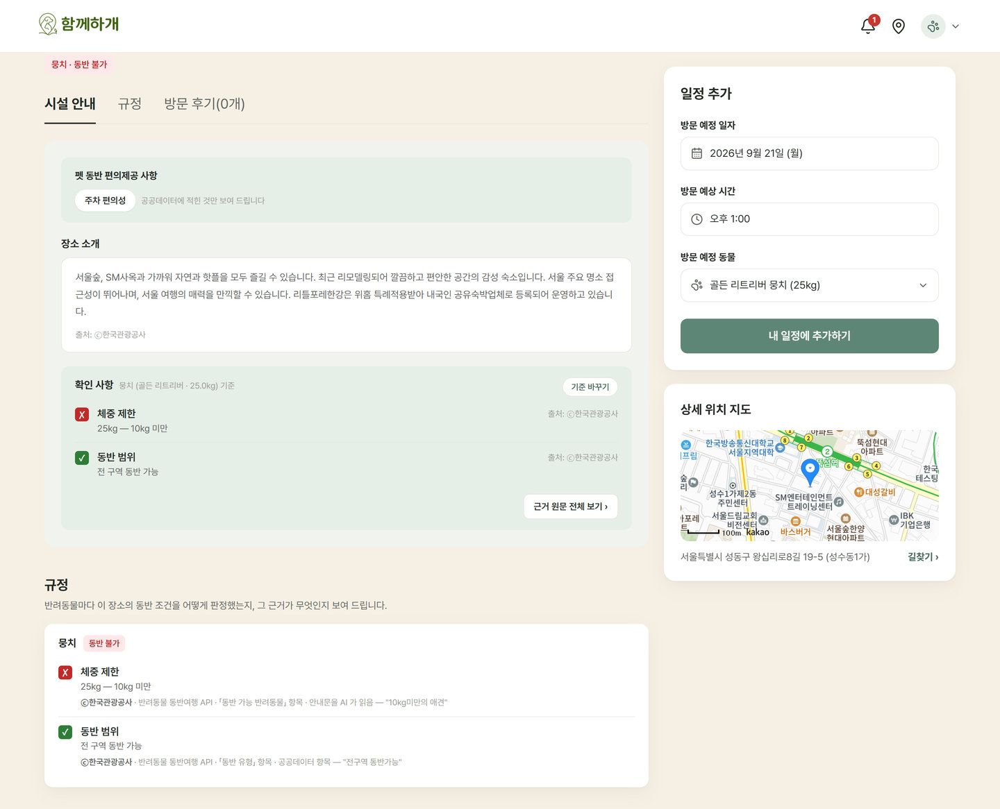

*같은 장소, 골든 리트리버 25kg 기준 — 「동반 불가」*

</details>

<br><br>

---

### #근거공개 — 판정마다 근거 원문을 붙입니다

판정 줄마다 어느 기관의 어떤 자료, 어느 항목에 무엇이 적혀 있었는지를 원문 문장 그대로 붙입니다.
그 값이 공공데이터 항목에 정해진 칸으로 있던 것인지, 안내문을 AI 가 읽어 낸 것인지도 함께 밝힙니다. AI 는 틀릴 수 있으므로, 「근거 원문 전체 보기」 로 누구나 원문을 직접 확인할 수 있습니다.

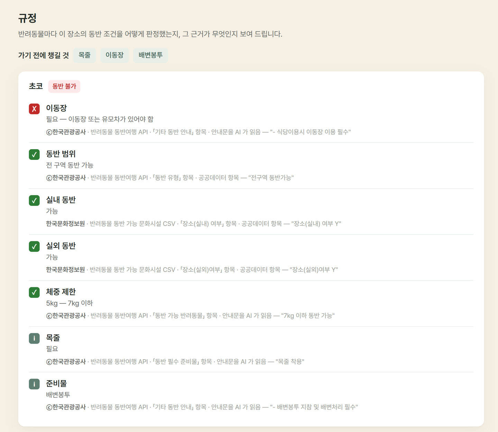

*한림공원의 규정 — 줄마다 기관 · 자료 · 항목, 그리고 원문 문장*

**맡은 곳** — [`ingest-service`](https://github.com/paw-trail/ingest-service#2-소스-4종이-서로-다릅니다) 가 원문을 그대로 모으고, [`extract-service`](https://github.com/paw-trail/extract-service#2-원문에서-조건을-읽는다는-것) 가 조건을 읽어 근거 문장을 고르며, [`policy-service`](https://github.com/paw-trail/policy-service) 가 근거를 보관합니다.

<details>
<summary>화면 더 보기 — 장소 상세 전체 · 기관별 원문</summary>

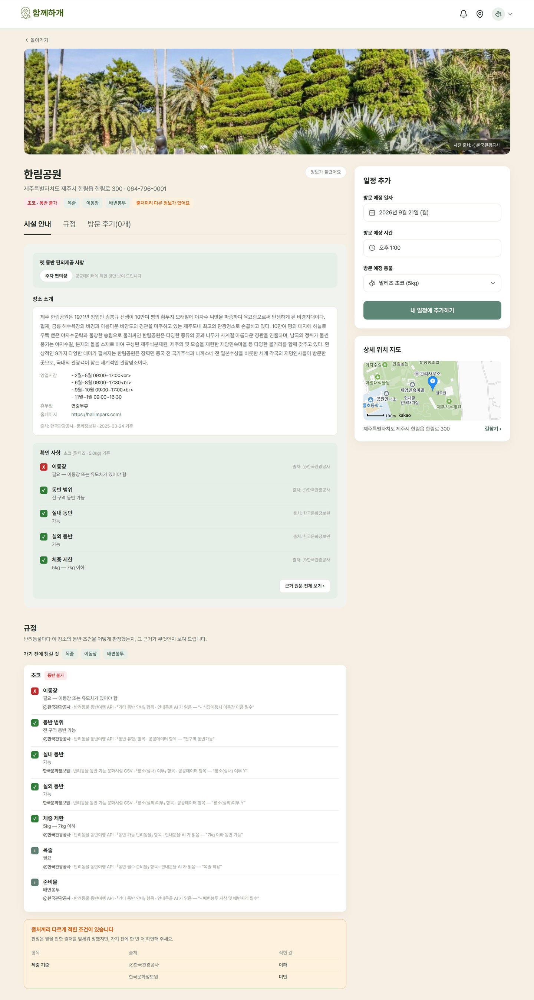

*한림공원 상세 전체 — 확인 사항 · 규정 · 출처끼리 다르게 적힌 조건*

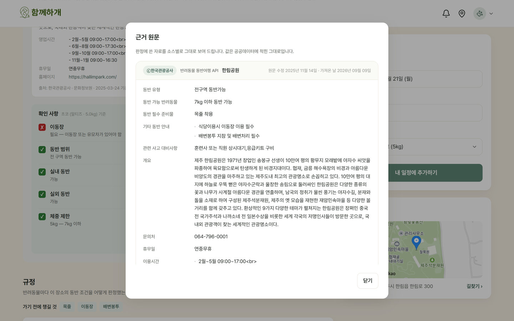

*근거 원문 — 한국관광공사 반려동물 동반여행 API 원문, 원문 수정일과 가져온 날*

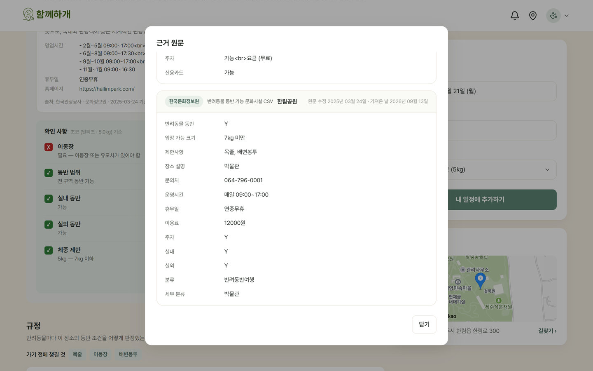

*근거 원문 — 한국문화정보원 반려동물 동반 가능 문화시설 CSV 원문*

</details>

<br><br>

---

### #교차검증 — 자료끼리 다르면 숨기지 않습니다

한 장소를 여러 자료에서 모아 하나로 합치고, 자료마다 조건이 다르면 한쪽을 고르지 않고 나란히 보여 줍니다. 같은 기관의 두 자료가 정면으로 다른 말을 하는 곳도 있습니다.
사용자는 「정보가 틀렸어요」 로 제보할 수 있고, 관리자가 확인해 처리하면 결과가 알림으로 돌아갑니다.

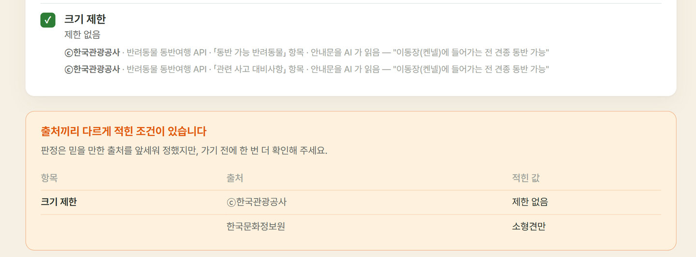

*옥토끼우주센터 — 크기 제한을 한 자료는 「제한 없음」, 다른 자료는 「소형견만」 으로 적었습니다*

**맡은 곳** — [`place-service`](https://github.com/paw-trail/place-service#3-어떻게-하나로-합치는가) 가 장소를 합치고, [`policy-service`](https://github.com/paw-trail/policy-service#2-출처마다-말이-다릅니다) 가 조건을 합치며 엇갈림을 기록하고, [`report-service`](https://github.com/paw-trail/report-service#2-1-제보-유형-5종) 와 [`notification-service`](https://github.com/paw-trail/notification-service#2-1-2종류) 가 제보와 알림을 맡습니다.

<details>
<summary>화면 더 보기 — 장소 상세 전체 · 제보 · 관리자 처리 · 알림</summary>

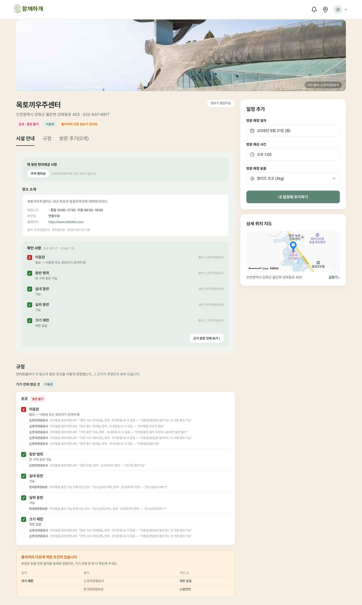

*옥토끼우주센터 상세 전체 — 이동장 조건의 근거 여러 줄과 출처끼리 다르게 적힌 조건*

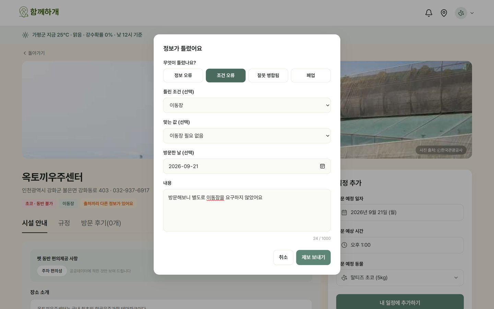

*「정보가 틀렸어요」 — 틀린 조건과 맞는 값을 골라 제보*

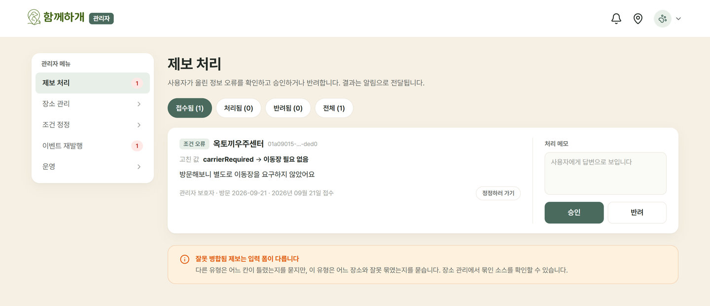

*관리자 제보 처리 — 승인 · 반려, 정정하러 가기*

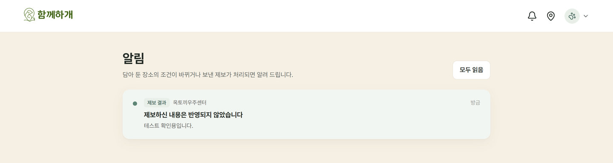

*처리 결과가 제보한 사람에게 알림으로 돌아갑니다*

</details>

<br><br>

---

## 3. 화면 구성 · 기능

화면은 26개입니다 — 사용자 21개 · 관리자 5개. 화면마다 경로는 [`frontend` README 의 화면 목록](https://github.com/paw-trail/frontend#0-2-화면-목록) 에 있습니다.

```
사용자      로그인 · 가입 ─▶ 반려동물 등록 ─▶ 메인 ─▶ 검색 결과 ─▶ 장소 상세 ─▶ 일정 · 길 안내
                                                                     ├─▶ 후기 작성
                                                                     └─▶ 정보가 틀렸어요 ─▶ 제보 처리 (관리자) ─▶ 알림

마이페이지  동반 기록 · 반려동물 정보 · 즐겨찾기 · 방문한 장소 · 작성한 후기
            최근 본 장소 · 계정 관리 · 알림 설정 · 문의 내역

관리자      제보 처리 · 장소 관리 · 조건 정정 · 이벤트 재발행 · 운영
```

「맡은 서비스」 칸의 이름은 `paw-trail` 조직의 각 레포로 이어집니다.

| 화면 | 하는 일 | 맡은 서비스 | 그림 |
|---|---|---|---|
| 로그인 · 계정 만들기 · 비밀번호 찾기 | 이메일 인증 코드로 가입 · 구글 로그인 · 가입하면 바로 로그인 · 비밀번호 재설정 | [auth](https://github.com/paw-trail/auth-service) | — |
| 반려동물 등록 | 가입 직후 반려동물 정보 입력 · 여러 마리 · 견종 45종 · 크기는 몸무게로 | [pet](https://github.com/paw-trail/pet-service) | [#내아이기준판정](#내아이기준판정--같은-장소도-반려견마다-답이-다릅니다) |
| 메인 | 지역 날씨와 비 예보 · 검색 · 종류 · 인기 급상승 · 최근 본 장소 · 지금 판정 기준 | [weather](https://github.com/paw-trail/weather-service) · [search](https://github.com/paw-trail/search-service) · [user](https://github.com/paw-trail/user-service) | [#헛걸음방지](#헛걸음방지--가기-전에-판정을-먼저-봅니다) |
| 검색 결과 | 지역 · 종류 · 편의시설로 거르기 · 판정으로 거르기 · 판정별 건수 · 평점순 · 거리순 (거리는 브라우저에서 계산) | [search](https://github.com/paw-trail/search-service) · [verdict](https://github.com/paw-trail/verdict-service) | [#헛걸음방지](#헛걸음방지--가기-전에-판정을-먼저-봅니다) |
| 장소 상세 | 반려견마다 판정과 이유 · 출처 · 기준 바꾸기 · 근거 원문 · 출처끼리 다른 조건 · 지도 · 일정 추가 · 후기 · 정보가 틀렸어요 | [place](https://github.com/paw-trail/place-service) · [verdict](https://github.com/paw-trail/verdict-service) · [policy](https://github.com/paw-trail/policy-service) · [ingest](https://github.com/paw-trail/ingest-service) · [review](https://github.com/paw-trail/review-service) · [report](https://github.com/paw-trail/report-service) · [user](https://github.com/paw-trail/user-service) | [#근거공개](#근거공개--판정마다-근거-원문을-붙입니다) · [#교차검증](#교차검증--자료끼리-다르면-숨기지-않습니다) |
| 후기 작성 | 반려동물 1~5마리 · 항목별 점수 · 사진 · 태그 · 좋아요 | [review](https://github.com/paw-trail/review-service#2-반려동물-스냅샷과-여러-마리) | — |
| 일정 · 길 안내 | 날짜별 일정 · 판정 뱃지 · 다녀왔어요 · 카카오맵 구간 길 안내 | [user](https://github.com/paw-trail/user-service) · [verdict](https://github.com/paw-trail/verdict-service) | 아래 그림 |
| 마이페이지 | 동반 기록 · 반려동물 정보 · 즐겨찾기 · 방문한 장소와 하루 AI 요약 · 작성한 후기 · 최근 본 장소 | [user](https://github.com/paw-trail/user-service) · [pet](https://github.com/paw-trail/pet-service) · [review](https://github.com/paw-trail/review-service) | [#내아이기준판정](#내아이기준판정--같은-장소도-반려견마다-답이-다릅니다) |
| 계정 관리 · 알림 설정 · 문의 내역 | 비밀번호 변경 · 탈퇴 · 알림 켜고 끄기 · 내가 보낸 제보 | [auth](https://github.com/paw-trail/auth-service) · [notification](https://github.com/paw-trail/notification-service) · [report](https://github.com/paw-trail/report-service) | — |
| 알림 | 즐겨찾기한 장소의 조건이 바뀔 때 · 보낸 제보가 처리될 때 | [notification](https://github.com/paw-trail/notification-service) | [#교차검증](#교차검증--자료끼리-다르면-숨기지-않습니다) |
| 관리자 — 제보 처리 | 승인 · 반려 · 정정하러 가기 | [report](https://github.com/paw-trail/report-service) | [#교차검증](#교차검증--자료끼리-다르면-숨기지-않습니다) |
| 관리자 — 장소 관리 · 조건 정정 | 장소 고치기 · 잘못 묶인 자료 떼기 · 수집 반영 대기 · 조건 정정 · 다시 합치기 | [place](https://github.com/paw-trail/place-service) · [policy](https://github.com/paw-trail/policy-service) | — |
| 관리자 — 이벤트 재발행 | 서비스마다 보내지 못한 이벤트를 다시 보냄 | [auth](https://github.com/paw-trail/auth-service) · [pet](https://github.com/paw-trail/pet-service) · [place](https://github.com/paw-trail/place-service) · [policy](https://github.com/paw-trail/policy-service) · [report](https://github.com/paw-trail/report-service) | — |
| 관리자 — 운영 | 한국관광공사 API 최신 수집 · 실행 기록 · 검색 색인 재구축 | [ingest](https://github.com/paw-trail/ingest-service) · [search](https://github.com/paw-trail/search-service) | [4절](#4-데이터가-흐르는-길) |
| 개인정보처리방침 | 로그인 없이 열림 | [frontend](https://github.com/paw-trail/frontend) | — |

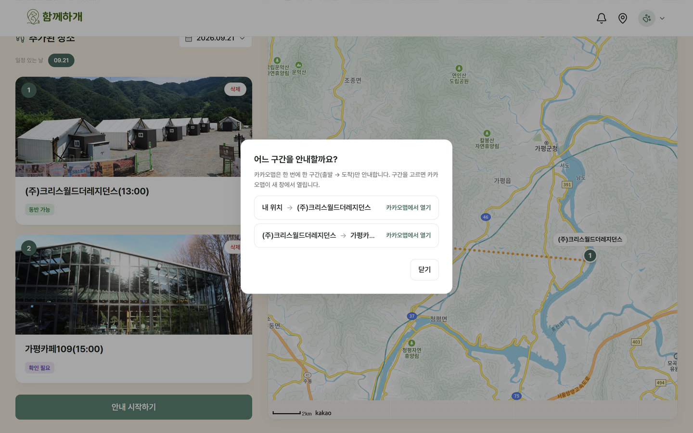

*일정 — 날짜별로 담은 장소와 판정 뱃지, 지도 위 동선, 구간을 골라 카카오맵 길 안내*

<br><br>

---

## 4. 데이터가 흐르는 길

공공데이터 원문이 판정이 되기까지 여섯 단계를 거치며, 단계마다 레포 하나가 맡습니다.

```
공공데이터 4종 ─▶ 수집 ─▶ 장소 합치기 ─▶ 조건 읽기 ─▶ 조건 합치기 · 교차검증 ─▶ 판정 ─▶ 검색 · 화면
```

| 단계 | 레포 | 하는 일 | 규모 |
|---|---|---|---|
| 수집 | [`ingest-service`](https://github.com/paw-trail/ingest-service#2-소스-4종이-서로-다릅니다) | 한국관광공사 반려동물 동반여행 API · 고캠핑 API · 한국문화정보원 CSV · 행정안전부 동물병원 CSV 를 원문 그대로 모읍니다. 바뀐 것만 다시 받는 증분 수집을 합니다 | 원문 17,471건 |
| 장소 합치기 | [`place-service`](https://github.com/paw-trail/place-service#3-어떻게-하나로-합치는가) | 주소 · 좌표 · 이름으로 같은 곳을 하나로 묶습니다. 애매하면 묶지 않습니다 | 장소 19,501곳 |
| 조건 읽기 | [`extract-service`](https://github.com/paw-trail/extract-service#4-5-두-번-읽기) | 정해진 칸은 규칙으로, 문장은 AI 가 두 번 읽어 더 조심스러운 쪽으로 합칩니다 | 조건 12,977행 |
| 조건 합치기 · 교차검증 | [`policy-service`](https://github.com/paw-trail/policy-service#3-어떻게-한-벌로-합치는가) | 자료마다 읽은 조건을 한 벌로 합치고 엇갈린 칸을 기록합니다. 관리자가 정정한 값이 가장 앞섭니다 | 근거 53,637줄 · 엇갈린 장소 114곳 |
| 판정 | [`verdict-service`](https://github.com/paw-trail/verdict-service#3-판정-규칙) | 반려견 정보와 조건을 맞대어 4단계로 판정하고 이유 줄을 붙입니다 | — |
| 검색 · 화면 | [`search-service`](https://github.com/paw-trail/search-service) · [`frontend`](https://github.com/paw-trail/frontend) | 검색 색인과 판정별 건수를 만들고 화면에 보입니다 | — |

<sub>규모는 2026년 9월 19일 전체 추출 기준입니다.</sub>

**AI 가 읽은 조건은 얼마나 맞나** — 조건 읽기에는 OpenAI `gpt-5.6-luna` 를 씁니다. 프롬프트를 다듬을 때 보지 않은 새 원문 40건으로 잰 결과 정밀도 93.2% · 재현율 94.0% 이고, 틀린 것은 전부 조건을 더 조이는 쪽이었습니다 ([재는 법과 숫자](https://github.com/paw-trail/extract-service#7-2-숫자)).
AI 가 읽은 값은 화면에 그렇다고 표시하고 원문을 함께 보여 주므로, 누구나 원문과 맞대어 볼 수 있습니다.

---

**#실시간수집 — 데이터가 바뀌면 다시 받습니다** — 관리자 화면에서 한국관광공사 API 의 최신 수집을 바로 실행할 수 있고, 매일 새벽 4시에는 바뀐 것만 받는 증분 수집이 예약으로 돕니다.
수집은 원문을 담는 데까지만 하고, 조건을 다시 읽는 일은 사람이 확인한 뒤 돌립니다.

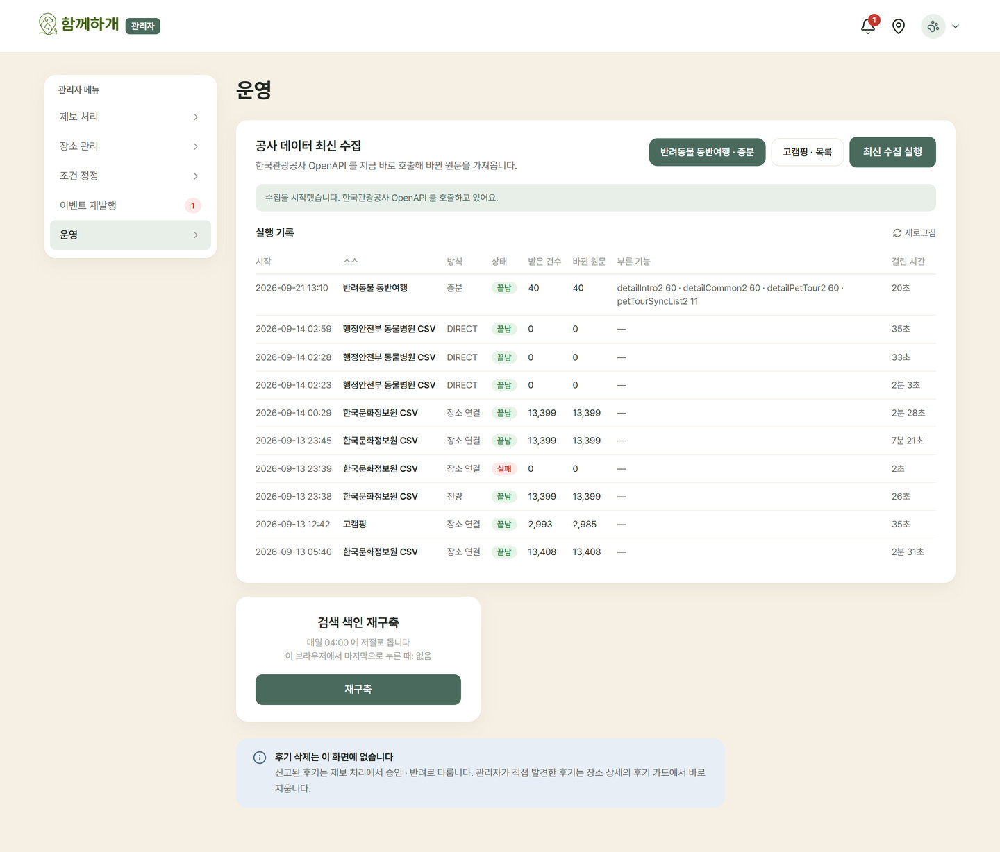

*관리자 운영 화면 — 소스마다 최신 수집 실행, 실행 기록, 검색 색인 재구축*

<br><br>

---

## 5. 구조

서비스는 16개입니다 — 입구 · 플랫폼 3개(`gateway-server` · `eureka-server` · `config-server`)와 도메인 13개.
데이터가 필요한 서비스는 자기 데이터베이스를 따로 가집니다(10개). 서비스끼리 값을 물을 때는 HTTP 로 부르고, 상태가 바뀐 사실은 Kafka 이벤트 6종으로 알립니다. 이벤트는 Outbox 로 보내고 Inbox 로 한 번만 처리합니다.


*그림의 가장자리(ALB · VPC · nginx)는 초기 설계 모습이며, 실제 배포는 [6절](#6-배포--운영) 에 있습니다. 그림 원본은 [`service-template`](https://github.com/paw-trail/service-template) 에 있습니다*

| 영역 | 기술 |
|---|---|
| 서버 | Java 21 · Spring Boot 4.1 · Spring Cloud 2025.1 (Gateway · Eureka · Config) · JPA · QueryDSL · Flyway |
| 데이터 | PostgreSQL 17 + PostGIS · pg_trgm · Redis · Kafka (KRaft) · AWS S3 |
| 서비스 사이 | RestClient + LoadBalancer · Kafka 이벤트 6종 · Outbox · Inbox |
| 인증 | JWT (RS256) · HttpOnly 쿠키 · 구글 OAuth2 · 이메일 인증 코드 |
| AI | OpenAI — 조건 읽기 · 하루 요약 |
| 화면 | React 19 · TypeScript · Vite · Tailwind CSS · TanStack Query · 카카오맵 |
| 관측 | Prometheus · Loki · Zipkin · Grafana |
| 배포 | Docker (amd64 · arm64) · GitHub Container Registry · Jenkins · Cloudflare · AWS Lightsail · WireGuard · nginx |

모든 서비스가 쓰는 코드(이벤트 · 오류 응답 · 로그인 사용자 읽기 등)는 [`common`](https://github.com/paw-trail/common) 모듈 하나에 모아, 서비스마다 같은 방식으로 씁니다. 전체 기술 목록은 [`service-template` 의 기술 스택](https://github.com/paw-trail/service-template#기술-스택) 에 있습니다.

<br><br>

---

## 6. 배포 · 운영

[paw-trail.click](https://paw-trail.click) 은 이렇게 돕니다.

```
브라우저 ─▶ Cloudflare ─▶ AWS Lightsail (nginx) ─▶ WireGuard ─▶ 미니 PC (게이트웨이 ─▶ 서비스 16개 · PostgreSQL · Kafka · Redis)
```

앞단 서버는 요청을 받아 암호화된 터널로 미니 PC 에 넘기기만 하고, 서비스와 데이터는 모두 미니 PC 한 대에서 docker compose 로 돕니다 ([`infra`](https://github.com/paw-trail/infra#4-7-앞단-nginx-lightsail)).

---

**릴리스 태그를 달면 배포됩니다** — 서비스 레포에 `vX.Y.Z` 태그를 달면 Jenkins 가 빌드 · 테스트 · 이미지 만들기를 하고, 미니 PC 에서 그 서비스만 바꿉니다.
새 인스턴스를 먼저 띄워 서비스 목록에 올린 뒤 옛 인스턴스를 빼므로, 바꾸는 동안에도 요청이 끊기지 않습니다 ([`jenkins-library`](https://github.com/paw-trail/jenkins-library#2-파이프라인-단계) · [`infra`](https://github.com/paw-trail/infra#4-9-jenkins-로-자동-배포)).

---

**운영 상태는 대시보드로 봅니다** — 서비스마다 요청 · 응답 시간 · JVM · DB · Kafka 지표를 모으고, 로그와 요청 추적을 한 화면에서 이어 봅니다 ([`infra` 의 관측 스택](https://github.com/paw-trail/infra#4-4-관측-스택)).

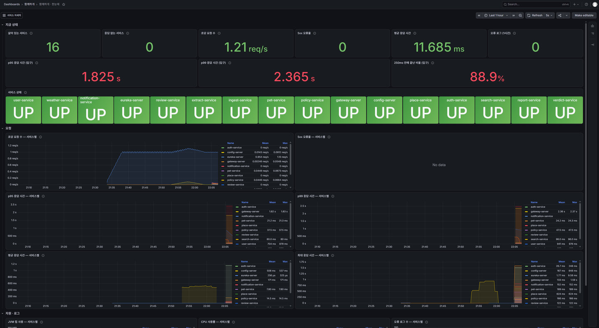

*운영 대시보드 「한눈에」 — 서비스별 상태 · 요청 · 응답 시간*

<details>
<summary>화면 더 보기 — 서비스 자세히</summary>

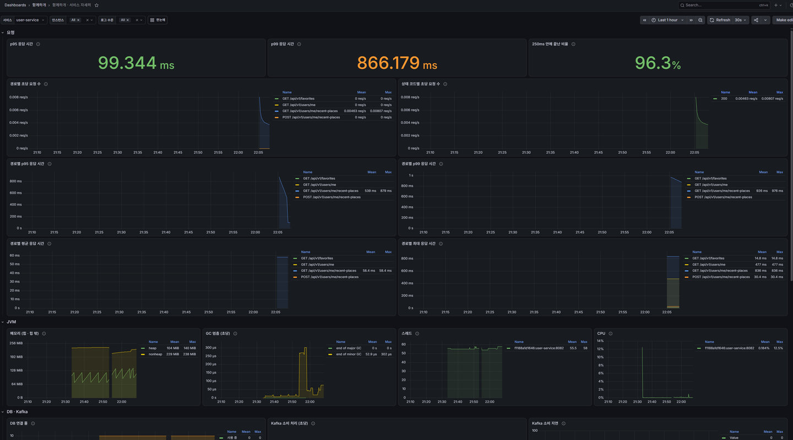

*서비스 자세히 — 경로별 응답 시간 · JVM · GC · 스레드*

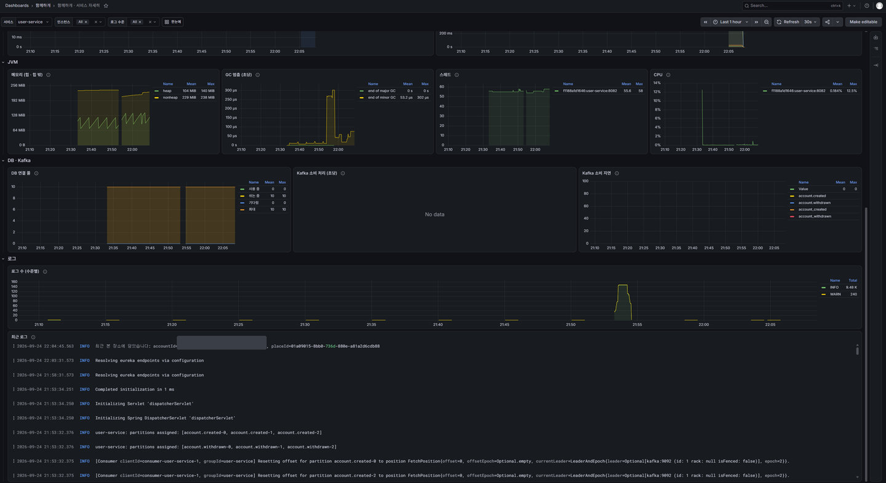

*같은 화면 아래 — DB 연결 · Kafka · 로그 (계정 식별자는 가렸습니다)*

</details>

<br><br>

---

## 7. 레포 안내

레포는 22개입니다. 레포마다 README 에 하는 일 · 로컬에서 띄우는 법 · 설계 까닭이 있습니다.

| 묶음 | 레포 | 하는 일 |
|---|---|---|
| 화면 | [`frontend`](https://github.com/paw-trail/frontend) | 웹 화면 (React · TypeScript) |
| 입구 · 플랫폼 | [`gateway-server`](https://github.com/paw-trail/gateway-server) | 모든 요청의 입구 · 로그인 확인 · 경로 나누기 |
| | [`eureka-server`](https://github.com/paw-trail/eureka-server) | 서비스 위치 목록 |
| | [`config-server`](https://github.com/paw-trail/config-server) | 설정을 나눠 주는 서버 |
| | [`config`](https://github.com/paw-trail/config) | 서비스별 설정 파일 |
| 사용자 | [`auth-service`](https://github.com/paw-trail/auth-service) | 가입 · 로그인 · 토큰 발급 · 탈퇴 |
| | [`user-service`](https://github.com/paw-trail/user-service) | 프로필 · 즐겨찾기 · 방문 기록 · 일정 · 하루 요약 |
| | [`pet-service`](https://github.com/paw-trail/pet-service) | 반려동물 정보 · 견종 45종 · 크기 정하기 |
| 데이터 흐름 | [`ingest-service`](https://github.com/paw-trail/ingest-service) | 공공데이터 원문 수집 |
| | [`place-service`](https://github.com/paw-trail/place-service) | 같은 장소 합치기 |
| | [`extract-service`](https://github.com/paw-trail/extract-service) | 원문에서 동반 조건 읽기 (규칙 + AI) |
| | [`policy-service`](https://github.com/paw-trail/policy-service) | 조건 합치기 · 교차검증 · 관리자 정정 |
| 판정 · 찾기 | [`verdict-service`](https://github.com/paw-trail/verdict-service) | 반려견마다 동반 판정 |
| | [`search-service`](https://github.com/paw-trail/search-service) | 검색 색인 · 판정별 건수 · 인기 급상승 |
| 참여 · 알림 | [`review-service`](https://github.com/paw-trail/review-service) | 후기 |
| | [`report-service`](https://github.com/paw-trail/report-service) | 정보 오류 제보와 처리 |
| | [`notification-service`](https://github.com/paw-trail/notification-service) | 알림 |
| | [`weather-service`](https://github.com/paw-trail/weather-service) | 기상청 단기예보 날씨 |
| 공통 · 운영 | [`common`](https://github.com/paw-trail/common) | 모든 서비스가 쓰는 공통 모듈 |
| | [`service-template`](https://github.com/paw-trail/service-template) | 새 서비스를 만드는 틀 · 전체 구조도 원본 |
| | [`infra`](https://github.com/paw-trail/infra) | 로컬과 서버에서 전체를 띄우는 docker compose · 배포 설정 |
| | [`jenkins-library`](https://github.com/paw-trail/jenkins-library) | 배포 파이프라인 |
